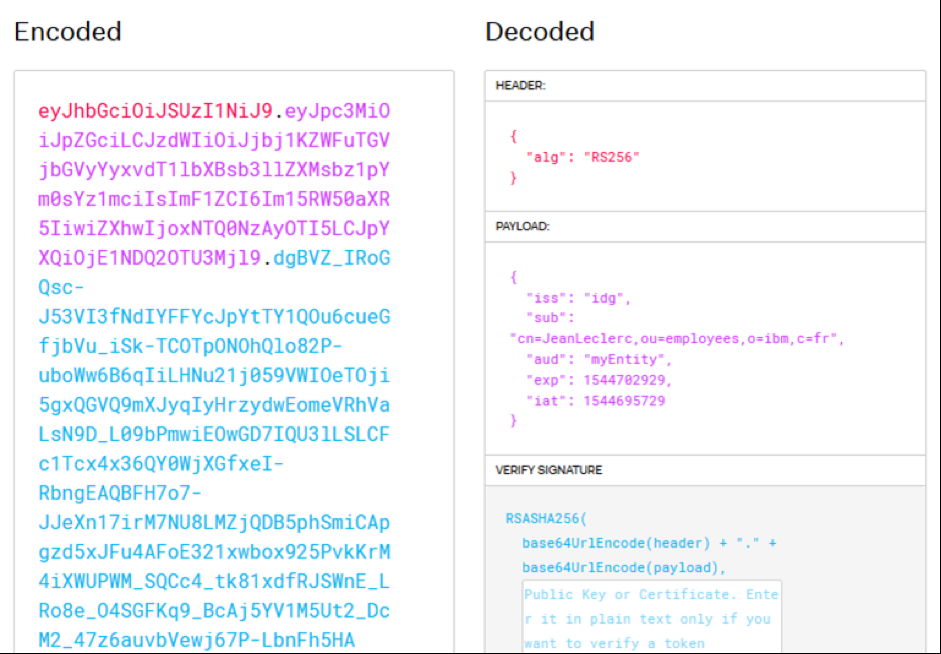

JSON Web Tokens (JWT): Now supported in CICS Liberty
====================================================

Author: Eric Phan

This blog aims to answer the following questions:

-   *What are JSON Web Tokens and why would I want to use them?*
-   *How do I use JSON Web Tokens with CICS?*
-   *Where do I find more information?*

Externalization of enterprise services through APIs drives a focus on
simplicity, security, and compatibility with standards-based external
systems. The industry is standardizing on the use of JSON Web Tokens
(JWT) for representing claims securely between two parties.

Below we show an example JWT:

The **header** specifies the algorithm being used (in this example an
RSA algorithm).

The **payload** contains the claims. Claims are statements about an
entity, for example what identity was used by a user login, or any other
type of claims as required by business processes, for example, that the
user is an administrator.

The **signature** is calculated using the header and the payload. The
JWT can be signed either using a shared symmetric key or the private key
of a trusted authentication server. The signature is used to verify that
the sender of the JWT is who it says it is. Additionally, as the
signature is calculated using the header and the payload, you can also
verify that the content hasn't been tampered with.

CICS Liberty supports the processing of JWTs in the following ways:

-   **JWT feature**
    The Liberty jwt-1.0 feature provides a set of APIs that you can use
    to programmatically build and consume JWTs.
    The JWT feature is supported in CICS Liberty since CICS TS V5.5. For
    CICS TS V5.3 and 5.4 the APAR PI91554 is required.
     

    **Download our step-by-step guide**
    Our CICS paper walks you through an example scenario of how a COBOL
    program can link to a Java program running in CICS Liberty, and how
    the Java program can use the JWT feature to build or consume a JWT.
    Sample code that you can use to test the configuration is provided
    in GitHub.

    Get the paper
    [here](https://developer.ibm.com/cics/wp-content/uploads/sites/65/2019/02/CICS-Paper-Using-the-Liberty-JWT-Feature-with-CICS.pdf).

-   **OpenID Connect Client (OIDC) feature**
    OpenID Connect is an open identity protocol, built on the OAuth 2.0
    protocol, that enables client applications to rely on authentication
    that is performed by an OpenID Connect Provider.
    CICS Liberty supports OpenID Connect 1.0 and can play a role as a
    Client, OpenID Connect Provider or Resource Server. For example, you
    can use the openidConnectClient-1.0 feature to configure CICS
    Liberty to accept a JWT as an authentication token. This support is
    also available with CICS Liberty since CICS TS V5.5, and with CICS
    TS V5.3 and 5.4 by applying APAR PI91554.

    For more information on configuring support for OpenID Connect with
    Liberty, see [Using OpenID
    Connect](https://www.ibm.com/support/knowledgecenter/SS7K4U_liberty/com.ibm.websphere.wlp.zseries.doc/ae/rwlp_using_oidc.html).

-   **Java™ Authentication Service Provider Interface for Containers
    (JASPIC)**
    JASPIC is a Java EE standard service provider API that enables the
    implementation of authentication mechanisms into Java EE Web
    Applications. You can develop a custom JASPIC authentication
    provider that authenticates a request using a JWT.

    For more information on using a TAI with CICS Liberty to validate a
    JWT, see the GitHub sample
    [cics-java-liberty-jaspic-jwt](https://github.com/cicsdev/cics-java-liberty-jaspic-jwt).

-   **Trust Association Interceptor (TAI)**
    You can configure CICS Liberty to integrate with a third-party
    security service by using a Trust Association Interceptors (TAI).
    The TAI can inspect the HTTP request to see whether it contains a
    specific security token, for example, a JWT.
    For more information on using a TAI with CICS Liberty to validate a
    JWT, see the GitHub sample
    [cics-java-liberty-tai-jwt](https://github.com/cicsdev/cics-java-liberty-tai-jwt#cics-java-liberty-tai-jwt).
